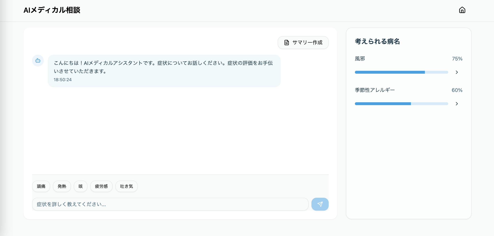

# medical-ai-chat
AIメディカル診断

- AIを利用して開発を行う
- 生成AIを利用したサービス

上記2点を満たす開発の練習用リポジトリ

構成は   
フロントエンド Next.js + TailwindCSS
バックエンド Python + FastAPI

要件定義、UIの作成をAIで行い、
バックエンドでは生成AIを呼び出し、フロントエンドとはweb socketでつなぐ
IDEにはCursorを利用してできるかぎりComposerに頼ってみる
